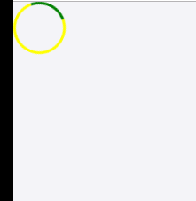
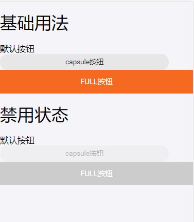
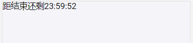
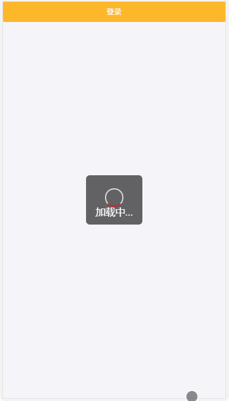

# UI 简易文档

[toc]

## ActivityIndicator



```javascript
import {ActivityIndicator} from '@UI';

...
<ActivityIndicator color="green" subColor="yellow"></ActivityIndicator>
...
```

| 属性         | 描述                         |类型 |可选值             | 默认值      |
|------------|------------------------------------------|----------|---|---|
| color        | 转动部分颜色              |string                        || '#E41A26'       |
| subColor        | 底色                |string                     | | '#fff' |

- - -

## Button


```javascript
  import {Alert} from '@UI';

  ...
  <h1>基础用法</h1>
  <Button type="defalut">默认按钮</Button>
  <Button type="capsule">capsule按钮</Button>
  <Button type="full">full按钮</Button>
  <h1>禁用状态</h1>
  <Button type="defalut" disable>默认按钮</Button>
  <Button type="capsule" disable>capsule按钮</Button>
  <Button type="full" disable>full按钮</Button>
  ...
```

| 属性| 描述|类型| 可选值| 默认值|
|------------|------------------------------------------|----------|-------------|---|
| type| 按钮类型|string| defalut/capsule/full|default|
| disable        | 禁用  |boolean                                    | |false
| active        | 激活	  |boolean                     |                |        false |
| onClick        | 点击回调   |function                   |                |  |
| children        | 按钮后置slot内容	                       |               |         |

- - -

## Countdown


```javascript
import {Countdown} from '@UI';
  
  ...
  render(){
    return (
      <h3>
        距结束还剩
        <Countdown
          localOffset={0}
          deadline={
            new Date(current.getTime()+24*60*60*1000)
            .getTime()
          }
        />
      </h3>
    )
  }
  ...
```

| 属性| 描述|类型| 可选值| 默认值|
|------------|------------------------------------------|----------|-------------|---|
| localOffset|本地偏移时间差，单位毫秒 |number| |0
| deadline        | 截止时间，暂时支持时间戳，单位毫秒  |number                                    | |
- - -


# Loading


Loading可以以服务的方式调用，引入Loading服务：
```javascript
import {Loading} from '@UI';
```
在需要时调用：
```javascript
Loading.show(<span>加载中...</span>);
```
其中参数接受的是string或者React元素，用来自定义显示在加载图标下方的加载文案内容。
关闭时调用：
```javascript
//异步关闭
setTimeout(()=>{
    Loading.hide();
  },5000)
```

# Icon：支持svg和css类型
svg:
```javascript
<svg viewBox="0 0 30 10" xmlns="http://www.w3.org/2000/svg">
  <circle id="myCircle" cx="5" cy="5" r="4"/>
  ...
</svg>
<Icon name="#myCircle"></Icon>
```
css类名：
```javascript
<Icon name="icon-user"></Icon>
<Icon name="iconfont-user"></Icon>
```


| 属性| 描述|类型| 可选值| 默认值|
|------------|------------------------------------------|----------|-------------|---|
| name| svg节点的id或者icon类名|string|#xxx或者icon-xxx |
- - -